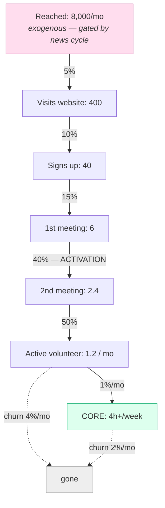
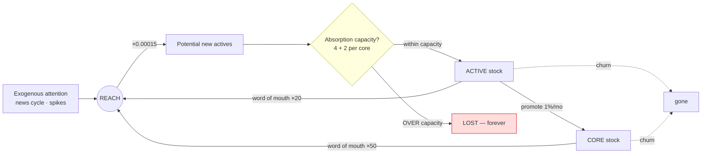
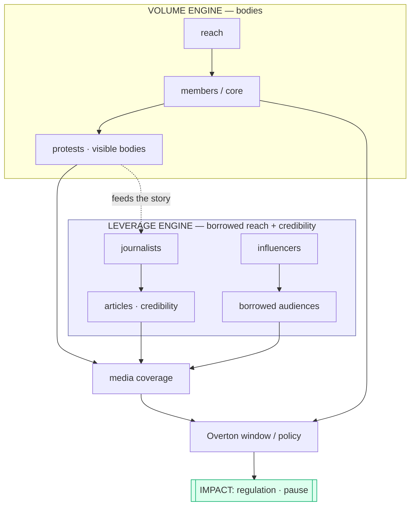

# Where PauseAI Germany Actually Bottlenecks

*An analysis with simulated numbers, flowcharts, and some reframing. Numbers are illustrative — plug your real ones into `growth_model.py` and the conclusions sharpen. The structure is the point, not the digits.*

---

## The one-paragraph version

You listed six bottlenecks. That's the first mistake — not because the list is wrong, but because **"a list of bottlenecks" is the wrong shape for the problem.** A growth pipeline is *multiplicative*, which means at any given moment there is essentially **one Binding Constraint**, and effort spent anywhere else is close to wasted. Worse: your intuition ("not enough people learning about us") is the bottleneck you *feel*, but it's probably not the one with the best return — because top-of-funnel attention is (a) largely **exogenous**, gated by the news cycle you don't control, and (b) pouring more water into a bucket whose bottom leaks doesn't fill the bucket. And worst of all, the analysis you'd run on a *normal month* tells you the opposite of what's true in the months that actually matter — the **surge months**, where most of your real growth either happens or is thrown away. Let me show you.

---

## Reframe 1 — You don't have six bottlenecks. You have one Binding Constraint at a time.

This is Goldratt's Theory of Constraints, and it is not a metaphor — it's arithmetic. Your pipeline is a chain of conversions:

> reached → website → sign-up → 1st meeting → 2nd meeting → active → core

Throughput at the bottom = the *product* of every stage's conversion rate. When you multiply fractions, **the smallest one dominates.** Doubling a stage that isn't the constraint moves your output by a rounding error. So "optimize all six" is not a strategy; it's the absence of one. The strategy is: *find the one stage that is currently strangling throughput, fix only that, watch the constraint move somewhere else, repeat.*

But here's the twist that makes this non-obvious. There are two different questions hiding inside "where's the constraint?":

- **Elasticity**: if this stage improved 10%, how much would core headcount grow?
- **Controllability**: how cheaply, and how far, *can* you actually improve it?

The real lever is `elasticity × controllability × headroom`. The model below computes the elasticity for you. The controllability you have to supply from judgement — and that's where "more awareness" loses, because its elasticity is high but its controllability is low (you can't *decide* to be in the news).

---

## Reframe 2 — A movement grows like an epidemic, not a sales funnel. Meet R.

A sales funnel is one-pass: attention comes in the top, customers fall out the bottom, done. A *movement* has a feedback loop a funnel doesn't: **members make more members.** They share, they bring friends, they show up at a protest that makes the news that reaches more people. That loop has a number, and epidemiologists named it a century ago: **R**, the reproduction number — how many new members one member causes over their active lifetime.

- **R < 1** → sub-critical. No organic engine. Every member you have traces back to *exogenous* attention. Turn off the news cycle and the movement decays toward zero.
- **R = 1** → self-sustaining. You hold.
- **R > 1** → exponential. The dream. The movement grows itself.

I ran your (illustrative) numbers:

```
R = 0.075
```

That is *deeply* sub-critical. It means: **PauseAI Germany, as modeled, has essentially no organic growth engine at all.** It is a funnel that processes whatever attention the world happens to throw at it, and when the attention stops, it bleeds out at its churn rate. To get R to 1 at your current conversion, each active member would need to generate ~267 units of reach/month, versus the ~20 a typical passive-sharing member generates. **That ~13× gap is the entire reason "please share our posts" never works and "personally bring one human to the next meeting" does.** Passive amplification is a rounding error on R. Personal recruitment is the only individual action with enough leverage to bend it.

This is the reframe I'd most want you to internalize: **the central growth question is not "how many people learn about us?" It is "what is our R, and what is the cheapest way to push it above 1?"** Everything else is downstream of that.

---

## The funnel, with simulated numbers



Walk it: **8,000 people see you in a normal month → 1.2 of them become active volunteers.** That's a 0.015% reach-to-active conversion. Run that to equilibrium and you get:

```
Active volunteers : ~28
Core (4h+/week)   : ~14
```

And — this is the quiet horror — **at equilibrium, inflow exactly equals churn.** You are not growing. You are treading water at ~14 core. Every new core member you celebrate is replacing one who quietly drifted out. The machine *feels* busy and *is* static.

---

## The stock-and-flow picture (where the feedback lives)



The dashed loop `A,C → REACH → A` is your organic engine. With R = 0.075 it's a loop that barely turns. The `CAP` diamond — absorption capacity — looks irrelevant in a normal month (potential = 1.2, capacity = 30+, no problem). **Hold that thought.** It is about to become the whole game.

---

## The Two Regimes — and why your average-month instincts are a trap

Here's the sensitivity analysis the model spits out — what a +10% improvement in each lever does to your steady-state core count:

```
lever                  %ΔCore @ +10%   elasticity
p_reach_to_active            +11.7%        1.17     <- conversion
baseline_reach               +10.0%        1.00     <- awareness (exogenous!)
churn_C                       -9.8%       -0.98     <- core burnout (a leak)
churn_A                       -8.5%       -0.85     <- volunteer drift (a leak)
p_promote                     +8.4%        0.84     <- active -> core
wom_per_core                  +0.9%        0.09
wom_per_active                +0.7%        0.07
onboard_per_core               0.0%        0.00     <- looks irrelevant...
leader_capacity                0.0%        0.00     <- ...looks irrelevant
```

Read naively, this *partly vindicates* your awareness intuition: reach and conversion are the top levers. But look at the bottom two: **absorption capacity has zero elasticity in a normal month.** A steady-state analysis says "don't bother building onboarding capacity, it doesn't move the needle."

That analysis is **catastrophically wrong**, and here's why.

### Regime 1 — Steady state (the boring 90% of months)
Constraint = **conversion + retention.** Awareness has high elasticity but you can't control it. So you control what you can: the activation step (1st→2nd meeting) and churn. These are cheap — they're about human experience, not money or news — and they *compound*, because a retained core member is an onboarding slot and a recruiter forever.

### Regime 2 — Surge (the 2–3 months a year that make the year)
AI salience is *spiky*. GPT-N drops, a scandal breaks, a politician says something — and reach 10×s or 100×s for a few weeks. Watch what the model does when I hit it with a 10× month and then a 100× month:

```
 month       reach   potential  absorbed   LOST     A     C
    18      81,249       12.2      12.2     0.0    38   14    <- 10x spike: caught it all
    30     801,419      120.2      33.4    86.8    66   15    <- 100x spike: caught 28%, LOST 72%
```

**In the mega-surge you lose 87 of 120 interested humans — 72% — because your onboarding capacity (4 + 2/core) is a wall the wave smashes into.** Over the full simulation, 44% of every interested person who ever showed up was lost, and almost all of that loss is concentrated in the surge months.

This is the punchline of the whole analysis:

> **The metric that looks irrelevant in the average month (absorption capacity) is the Binding Constraint in the months that actually produce your growth.** Optimizing for the boring months optimizes for the wrong regime.

And notice the cruel coupling: absorption capacity scales with core headcount (`4 + 2×core`). **A bigger core catches a bigger wave.** So the steady-state work (build core, reduce churn) and the surge work (absorb the wave) are not in tension — the first *is* the precondition for the second.

---

## The Catch-Basin

Here is the concept I'd name and build the whole strategy around. Call it **the Catch-Basin.**

You cannot manufacture the wave. AI salience is exogenous — it spikes when reality forces it to, not when you'd like. What you *can* do is build the basin that catches the water when it comes: scalable self-serve onboarding that doesn't need a human for the first three steps, a clear ladder of asks waiting for newcomers, pre-written everything, and — critically — **being the Schelling point.** When a German wakes up frightened about AI and types something into a search bar or asks "who do I even talk to about this," the answer has to *already* be PauseAI Germany. You don't build that during the surge. You build it in the boring months, so it's load-bearing when the surge arrives.

Reframed: **don't optimize the average month. Pre-position for the peak weeks.** Most of your decade's growth will arrive in a handful of moments you can see coming in kind but not in date. The work now is making sure that when one hits, you convert it instead of watching 72% of it evaporate.

---

## The Leverage Engine — and why "minimal right now" might be your most expensive mistake

Everything above is the **Volume Engine**: bodies → core → protests. But you flagged journalists and influencers as minimal, and I want to push hard here, because I think you're under-rating it.



These are **two different products with two different funnels feeding one outcome.** And the math is wildly different. One journalist relationship → one article → 50,000 reach *plus* third-party credibility *plus* a direct line to the Overton window — bypassing your volunteer funnel entirely. One aligned influencer → a borrowed audience of hundreds of thousands. The conversion from "elite reach" to *impact* doesn't route through your leaky 0.015% funnel at all.

Here's the load-bearing claim, and I'll say it plainly: **if PauseAI's theory of change is "shift what is politically possible," then the Leverage Engine may be the higher-EV engine outright — and "minimal right now" means your actual Binding Constraint on *impact* (as opposed to *headcount*) is sitting almost untouched.** The Volume Engine's deepest purpose might even be instrumental to the Leverage Engine: protests exist partly *because they make news*. Bodies are an input to the story, not the final output.

This deserves its own funnel model (journalists contacted → responded → covered once → covered repeatedly → friendly-by-default), and it's the thing I'd most want real numbers on from you.

---

## The Leader Bottleneck (the blunt one)

In a small org the constraint is very often not on any flowchart — it's that **everything routes through one person.** Onboarding, media, strategy, the Discord, the newsletter: if those all pass through you, then your real capacity ceiling is *your weekly hours*, and no amount of top-of-funnel reach changes it. The model encodes this as `leader_capacity = 4` — a floor that exists even with zero core. The fastest way to raise the org's ceiling is usually to make yourself **not** the absorption bottleneck: a self-serve onboarding path, and 2–3 people who own recruitment/media/onboarding *without you in the loop.* This is uncomfortable because it trades short-term control for ceiling. Name it, because it's the constraint that disguises itself as "I'm just busy."

---

## Other framings I considered

1. **Goodhart's List.** "Members" is a proxy for impact, and proxies decohere from their target under optimization pressure. You can grow the mailing list while impact *falls* (more low-commitment names, diluted core, busier-looking but less effective). Pick an output metric that resists this — I'd argue **effective core-hours/week + repeated credible public presence**, not list size.

2. **Geographic density beats geographic spread.** 3 people each in 30 cities is far weaker than 30 people in 3 cities — because in-person local critical mass is what drives the activation and friendship that drive retention. If your members are scattered, the constraint might be *density*, not *count*. Concentrate before you spread.

3. **People stay for people, not for the cause.** Retention (your 1st→2nd-meeting drop) is overwhelmingly a *social-bond* phenomenon. "Did this person make one friend and get one real role at their first meeting?" predicts the 2nd meeting better than anything about AI. The activation step is a *belonging* problem wearing a logistics costume.

4. **The Ladder of Engagement.** Funnels leak where the next ask is wrong-sized. "Come to a meeting" is a weak, vague ask. A ladder — micro-task → small commitment → named role → core — with each rung sized to be the obvious next step, is how you convert attendance into identity. Most of your 1%/mo promotion rate is low because nobody is *asked* and *equipped* to climb.

5. **R is the master variable, and personal recruitment is its lever.** From Reframe 2: the only individual behavior with enough leverage to move R is core members personally recruiting. Most movement members *never once* personally ask another human to join. The cheapest 10× you have is probably "make personal recruitment a normal, expected, equipped core-member behavior" — that's the difference between wom≈20 and wom≈267.

---

## What I'd actually do (in priority order)

1. **Instrument the funnel.** You can't find a Binding Constraint you can't see. Get real numbers for each stage in the first flowchart — even rough ones. This is the single highest-value action because every recommendation below changes depending on them.
2. **Compute your real R.** If it's < 1 (it will be), accept that you have no organic engine yet, and treat "get R toward 1" as a top-line goal, not an afterthought.
3. **Build the Catch-Basin before the next surge.** Self-serve onboarding (no human needed for steps 1–3), a waiting ladder of asks, pre-written surge playbook. Measure it by "how many could we absorb in a week if reach 100×'d tomorrow?"
4. **Fix activation, not awareness.** The 1st→2nd meeting drop is your cheapest, most controllable, most compounding lever. Make first meetings give every newcomer one friend and one role.
5. **Start the Leverage Engine deliberately.** Pick 10 journalists and 10 influencers. Build relationships *now*, in the boring months, so they call *you* when the surge hits. This is plausibly your highest-EV-per-hour activity and it's near-zero today.
6. **De-bottleneck yourself.** Hand recruitment, media, and onboarding to named owners. Trade control for ceiling.

---

## How to use the model

`growth_model.py` is parameterized. Edit `PARAMS` at the top with your real numbers and re-run:

```
python3 growth_model.py
```

It prints your funnel, your steady state, your R, a sensitivity ranking (which lever wins *for your numbers*), and a surge test showing how much of a wave you'd catch vs. lose. The conclusions above are robust to the exact digits — but *which* lever ranks #1 will shift once the numbers are yours, and that's exactly the decision you want the model to make legible.

---

## Assumptions, and what would change my mind

These conclusions rest on premises I'm naming so you can attack them:

- **The funnel is roughly multiplicative and roughly these magnitudes.** If your real conversions are wildly different (e.g. your sign-up→active is 40%, not 0.4%), the Binding Constraint moves and some advice flips. → *Get the real numbers.*
- **R is currently << 1.** I'd bet heavily on this for almost any volunteer movement, but if you have real organic/viral growth I haven't accounted for, the "no engine" framing weakens.
- **Impact ≈ f(core capacity, public salience, elite/policy reach), and the third term is under-served.** If PauseAi DE's theory of change is genuinely mass-mobilization rather than Overton-shifting, the Leverage Engine drops in priority. I don't think it is, but that's *your* call about the org's actual strategy, and it's the load-bearing premise behind recommendation #5.
- **AI salience will keep spiking.** If you believe attention will instead rise as a smooth ramp, the Catch-Basin / two-regime framing matters less and steady-state optimization matters more. I think spiky is much more likely than smooth, but it's a real fork.

If you hand me even rough real numbers for the funnel stages and current core/churn, I'll re-run this and tell you which single constraint to attack first — with your digits, not mine.
